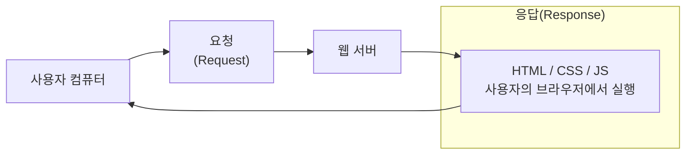

# HTML과 CSS 이해(HTML)

## 사전 학습



- 웹 서버로부터 받은 HTML, CSS, Javascript를 사용자 컴퓨터에 다운 받은 후 순서에 맞게 실행하게 됨
  - 개발자 모드(cmd + option + i)를 사용하여 css를 수정할 수 있는 것도 내 컴퓨터에 다운 받은 css를 임의로 수정하는 것으로 보면 됨

## 웹 구성요소

- HTML(구조 생성)
  - 텍스트, 이미지, 입력창 등 웹에서 보는 요소(Element)를 정의할 때 사용
  - HTML은 화면을 구성하는 언어
- CSS(디자인)
  - HTML에 정의된 요소들에 스타일(색깔, 간격, 크기 등)을 부여
  - CSS는 화면을 구성하는 언어
- JS(웹의 동작)
  - 버튼을 클릭했을 때, API 서버와 통신할 때 등 모든 동작들을 처리
  - JS는 동작하는 언어

## HTML

- HTML 태그는 정보를 보여주는 역할을 함
- 이미지, 텍스트, 비디오, 입력창 등의 개별 정보는 전부 HTML로 부터 만들어짐

### HTML 태그 기본 문법

- 기본 형식 : `<태그>컨텐츠</태그>`

  ```html
  <p>Hello World!</p>
  ```

- HTML에서 주석 사용 : `<!-- 값 -->`

  ```html
  <!-- 주석을 사용하는 방법 -->
  <!-- 맥북의 경우 command + /를 입력 시 주석이 입력됨 -->
  ```

- 속성이 있는 형식 : `<태그 속성="값">컨텐츠</태그>`
  - 속성은 태그에 붙는 설정값으로 `href` 속성으로 목적지를 지정

  ```html
  <!-- a 태그는 링크를 넣는 태그 -->
  <!-- href 속성으로 목적지를 지정 -->
  <a href="https://www.google.com"> 구글로 바로가기</a>
  ```

- 태그 안에 태그를 넣는 형식
  - HTML 요소를 계층 구조(부모-자식)으로 만들게 됨

  ```html
  <!-- 
  <바깥태그>
    <안쪽태그>내용</안쪽태그>
  </바깥태그>
  -->

  <!-- div 태그는 공간을 나눠주는 태그 -->
  <div>
    <p>Hello world!</p>
  </div>
  ```

- 컨텐츠가 따로 없을 때의 형식 : `<태그 속성="값" />`
  - `` : 이미지를 보여주는 태그
  - `src` 속성 : 이미지 주소
  - 이미지 태그는 내용이 없이 동작하는 태그로 컨텐츠가 없을 때의 형식으로 사용됨
  ```html
  <br />
  
  ```

### HTML로 웹 기본 구성

- HTML로 웹을 구현하기 위해선 기본적으로 설정하는 태그 형식이 있음
- [web.html 파일 참고](../src/web.html)
  - vscode에서 `open in browser` 확장 프로그램 설치 후 web.html 파일을 우클릭해서 브라우저에서 미리보기 가능

### HTML 주요 태그

> h1,h2,h3,h4,h5,h6

- headline의 약자로 일반적으로 제목을 표시할 때 사용하는 태그
- 줄바꿈 : O
- 기본 너비 : 부모 너비
  ```html
  <h1>Hello world!</h1>
  <h2>Hello world!</h2>
  <h3>Hello world!</h3>
  <h4>Hello world!</h4>
  <h5>Hello world!</h5>
  <h6>Hello world!</h6>
  ```

> p

- 일반적으로 문단(paragraph)을 나눌 때 사용하는 태그
- 일반 텍스트를 표시할 때 주로 사용
- 줄바꿈 : O
- 기본 너비 : 부모 너비

> br

- 줄바꿈을 할 때 사용하는 태그
  ```html
  <!-- 한 줄의 공백이 생기게 됨 -->
  <br />
  ```

> a

- 다른 링크로 넘어가게 해주는 태그
- 필수 속성으로 `href="주소"` 를 적어야 됨
- 줄바꿈 : X
- 기본 너비 : 콘텐츠 너비
  ```html
  <a href="https://www.naver.com">네이버로 바로가기</a>
  ```

> img

- 이미지를 보여주는 태그
- 필수 속성으로 `src="이미지 주소"`를 적어야 됨
- `alt` 속성은 이미지가 보여지지 않았을 때 대체될 문구
- 줄바꿈 : X
- 기본 너비 : 이미지 너비
  ```html
  
  ```

> form , input

- `form` 태그는 내부에 입력하는 값들을 관리해주는 태그이고, `input` 태그를 사용해서 입력창을 생성하게 됨
  - form 태그 안에는 `input` 태그들이 들어감
  - 로그인, 상품 업로드 등 사용자가 입력을 해야할 때 form 태그가 사용됨
  - form의 속성 중 `action` 은 Submit(제출하기)이 눌렀을 때 입력된 서버 URL로 정보를 전송함
- input 태그에는 `type` 속성을 통해 text, password, radio, file, submit 등을 통해 속성을 넣을 수 있음
- `label` 태그는 input 태그의 이름(라벨)을 붙일 때 사용
  ```html
  <form action="">
    <label>아이디 입력 </label>
    <input type="text" />
    <br />
    <label>패스워드 입력</label>
    <input type="password" />
    <!-- 타입을 패스워드로 지정하면 ****로 표시됨 -->
    <br />
    <input type="submit" value="전송" />
  </form>
  ```

> div

- 영역을 나누도록 도와주는 태그
- div를 통해 요소들을 한 덩어리로 묶어주게 됨
- 줄바꿈 : O
- 기본 너비 : 부모 너비
  ```html
  <div>
    <p>귀여운 강아지 사진입니다.</p>
    
  </div>
  ```

> span

- `div` 와 함께 CSS를 이용해서 영역을 구성할 때 많이 사용
- div는 줄바꿈이 되며 기본 너비가 부모의 너비를 차지한다면, span 태그는 줄바꿈이 되지 않고, 자식 콘텐츠의 너비만큼을 차지하게 됨
- 줄바꿈 : X
- 기본 너비 : 콘텐츠 너비
  ```html
  <p>이 문장에서 <span class="highlight">이 부분</span>만 강조합니다.</p>
  ```
  ```css
  .highlight {
    color: red;
    font-weight: bold;
  }
  ```
