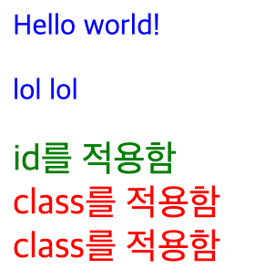
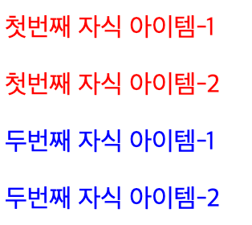
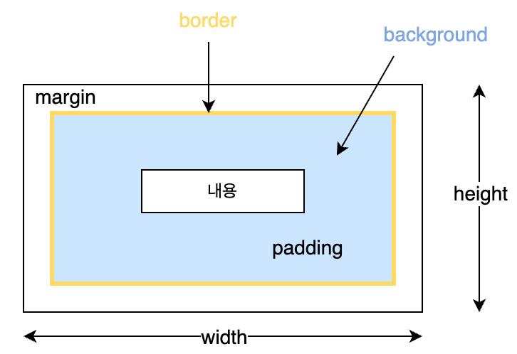
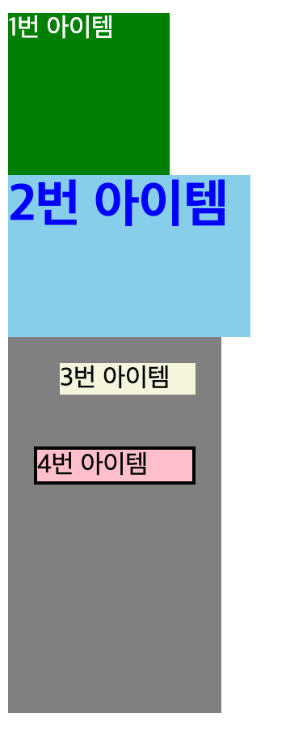

# HTML과 CSS 이해(CSS)

## CSS

- CSS는 HTML 태그에 디자인을 부여하는 언어
- 보통 웹 개발 시 HTML 태그로 요소들을 구성하고, CSS로 디자인을 하고 배치를 하게됨

### CSS 기본 문법

- 형태
  ```css
  선택자 {
    속성1 : 값;
    속성2 : 값;
    ...
  }
  ```

> 선택자(Selector)

- 선택자는 스타일을 적용할 대상으로 `tag`, `id`, `class` 등을 선택할 수 있음
- 태그를 선택자로 하게 되면 모든 태그에 스타일이 적용됨
- `id` 는 하나의 요소에만 적용
  - HTML 문서 안에서 절대 중복되면 안됨

  ```html
  <!-- 올바른 사용 -->
  <h1 id="title">제목</h1>

  <!-- ❌ 잘못된 사용 -->
  <h1 id="title">제목1</h1>
  <h2 id="title">제목2</h2>
  <!-- 규칙 위반 -->
  ```

- `class`는 class를 가진 모든 요소에 적용

  ```css
  /* 태그 선택자*/
  /* 모든 p 태그에 적용 */
  p {
    color: red;
  }

  /* id 선택자 (#을 사용) */
  /* id="title"을 가진 하나의 요소만 선택 */
  #title {
    color: blue;
  }

  /* class 선택자 (.을 사용) */
  /* class="item"을 가진 모든 요소 선택 */
  .item {
    color: red;
  }
  ```

> 선택자 조합

- 선택자 여럿을 , 로 묶어서 같은 속성을 적용할 수 있음

  ```css
  # item1,
  .class1 {
    color: red;
  }
  ```

- 기본 문법 연습
  - [learn-css.html 참고](../src/learn-css.html)
  - 적용 예시

    

> 복합 선택자

- `tag`, `id`, `class`가 기본선택자라면 이것들을 결합한 선택자를 복합 선택자라 함
- 복합 선택자의 종류엔 하위 선택자(Descendant Selector)와 자식 선택자(child Selector) 등이 있음
  - 하위 선택자
    - `선택자1 선택자2`와 같이 띄어쓰기로 구분
    - 깊이 상관없이 안에만 있으면 전부 적용됨

    ```css
    부모 자식 {
      스타일;
    }
    ```

    - 예시

    ```css
    div p {
      color: red;
    }

    <div>
      <p>이 문장은 빨간색</p>
      <section>
        <p>이 문장도 빨간색</p>
      </section>
    </div>
    ```

  - 자식 선택자
    - `선택자1 > 선택자2`와 같이 `>` 기호로 구분
      - 한 단계 아래만 적용

    ```css
    부모 > 자식 {
      스타일;
    }
    ```

    - 예시

    ```css
    div > p {
      color: blue;
    }

    <div>
      <p>이 문장은 파란색</p>
      <section>
        <p>이건 적용 안 됨</p>
      </section>
    </div>
    ```

- 기본 문법 연습
  - [learn-css-2.html 참고](../src/learn-css-2.html)
  - 적용 예시

    

### CSS에서 자주 쓰이는 속성

- css는 속성과 값을 통해서 디자인을 하게 됨

  ```css
  선택자 {
    속성: 값;
  }

  p {
    color: red;
  }
  ```

  | 구분    | 의미              |
  | ------- | ----------------- |
  | `p`     | 선택자 (누구에게) |
  | `color` | 속성 (무엇을)     |
  | `red`   | 값 (어떻게)       |

> width, height (크기)

- 요소의 가로(width) 와 세로(height) 크기를 지정
  ```css
  .box {
    width: 200px;
    height: 100px;
  }
  ```

> color, background-color (색상)

- 글자의 색상을 지정하고, 배경색을 지정
  ```css
  p {
    color: white;
    background-color: black;
  }
  ```

> font-size, font-weight (글자 스타일)

- 글자의 크기와 굵기를 지정
  ```css
  .title {
    font-size: 24px;
    font-weight: bold;
  }
  ```

> margin, padding (여백)



- margin은 이 요소와 다른 요소 사이의 바깥쪽 여백
- padding은 이 요소의 안쪽에서 내용과 테두리 사이의 여백(내용과 테두리 사이의 공간)
  ```css
  .box {
    margin: 10px;
    padding: 20px;
  }
  ```

> border(테두리)

- 요소의 테두리를 설정

  ```css
  /* border: 두께 스타일 색상; 
  두께: 1px
  스타일: solid, dashed, dotted
  색상: black, red 등 */

  .box {
    border: 1px solid black;
  }
  ```

- 기본 문법 연습
  - [learn-css-3.html 참고](../src/learn-css-attributes.html)
  - 적용 예시

    
