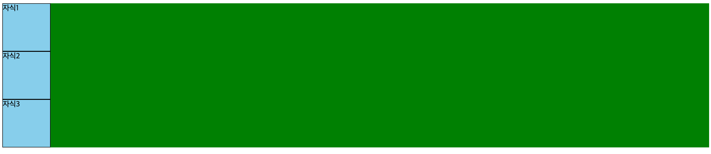
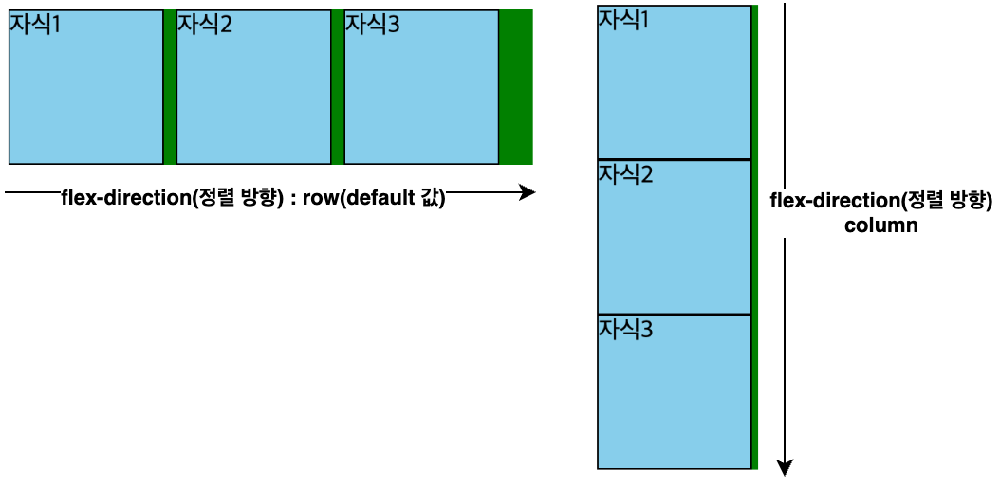
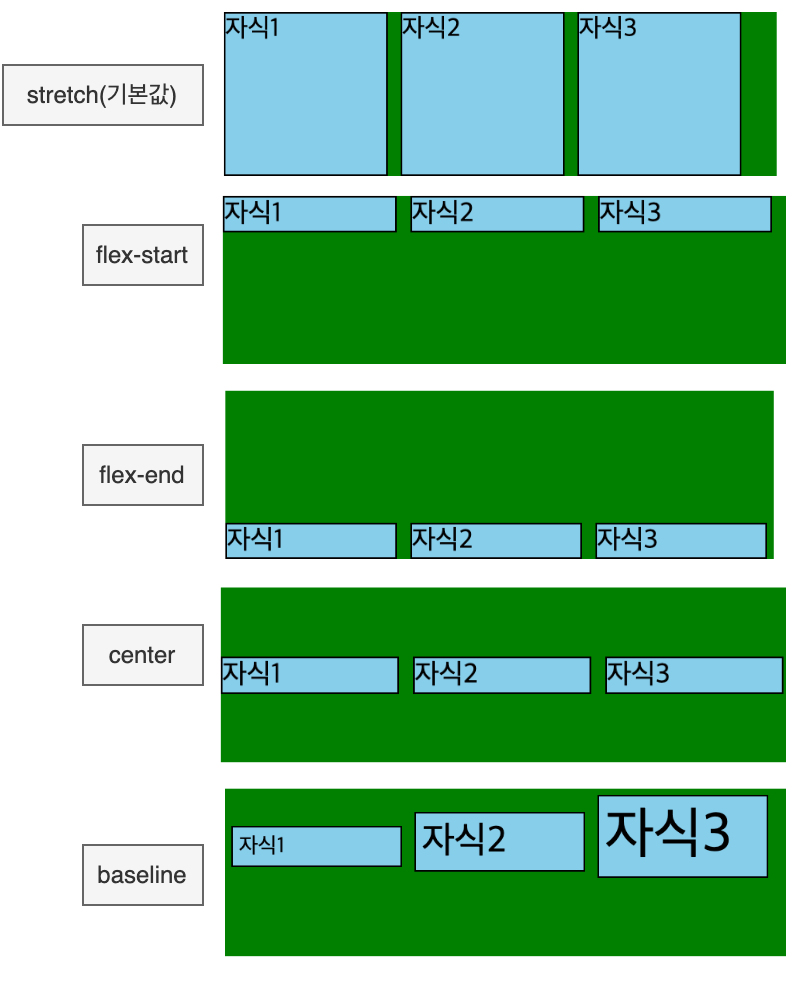
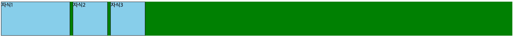
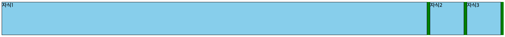
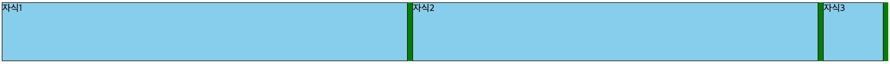
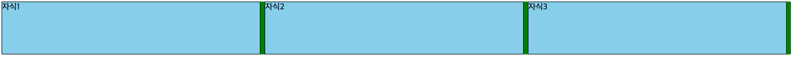
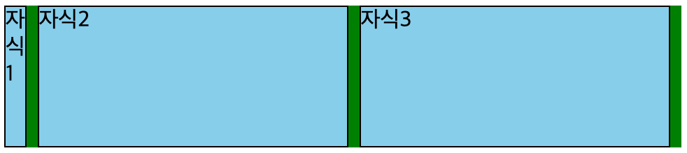

# Flex layout

## Flex란?

- 웹에서 요소들을 배치하기 위해 예전에는 `float`와 `display 속성(table, inline-block)` 등을 사용했지만 요즘엔 `flex`가 많이 사용됨
  - 기존에 `DIV` 요소는 줄바꿈이 되어 수직으로 배치되는데, 이를 수평적으로 배치하는 방법은?
  - 자식 요소를 부모 기준으로 가운데 정렬을 하는 방법은?
- 웹(리액트), 앱(리액트네이티브)에서 대부분의 요소를 Flex로 배치하게 됨

## Flex Layout 익히기

- Flex의 핵심은 `Container`와 `Item`임
- `Container`는 부모가 되고 `Item`은 자식이 됨

## 코드 연습

### 기본 코드

```html
<html>
  <head>
    <style>
      .parent {
        background-color: green;
      }

      .child {
        width: 100px;
        height: 100px;
        background-color: skyblue;
        margin-right: 8px;
        border: 1px solid black;
      }
    </style>
  </head>

  <body>
    <div class="parent">
      <div class="child">자식1</div>
      <div class="child">자식2</div>
      <div class="child">자식3</div>
    </div>
  </body>
</html>
```



### 컨테이너(부모)속성 수정

> flex-direction

- 전제 조건으로 `display: flex;`가 있어야 됨
- flex-direction 추가 시 자식 아이템들이 기본값인 수평(row 값)으로 배치됨
  ```css
  .parent {
    background-color: green;
    display: flex;
    flex-direction: row; /* column or row*/
  }
  ```
  

> justify-content

- flex 컨테이너 안에서 아이템들을 어떤 방향으로 배치할지 결정하는 속성
- 전제 조건으로 `display: flex;`가 있어야 됨
- flex-start(기본값)
  - 아이템을 왼쪽에서부터 차례대로 배치
  ```css
  .parent {
    background-color: green;
    display: flex;
    justify-content: flex-start;
  }
  ```
  ```css
  |■ ■ ■      |
  ```
- flex-end
  - 아이템을 오른쪽에서부터 차례대로 배치
  ```css
  justify-content: flex-end;
  ```
  ```css
  |      ■ ■ ■|
  ```
- center
  - 아이템을 가운데에서부터 차례대로 배치
  ```css
  justify-content: center;
  ```
  ```css
  |   ■ ■ ■   |
  ```
- space-around
  - 아이템 양쪽에 동일한 여백을 줌
  ```css
  justify-content: space-around;
  ```
  ```css
  |  ■   ■   ■  |
  ```

> align-items

- flex 컨테이너 안에서 아이템들을 세로(교차축) 방향으로 어떻게 정렬할지 결정하는 속성
- 전제 조건으로 `display: flex;`가 있어야됨
- stretch(기본값)
  - 아이템에 `height`가 없을 때 아이템(자식)이 컨테이너(부모) 높이만큼 늘어남
  - 아이템에 height가 없는 경우 div에 들어있는 텍스트의 크기만큼이 높이로 자동으로 지정됨

  ```html
  <style>
    .parent {
      background-color: green;
      height: 100px;
      display: flex;
      align-items: stretch;
    }

    .child {
      width: 100px;
      /* 자식의 높이 비활성화 */
      /* height: 100px; */
      background-color: skyblue;
      margin-right: 8px;
      border: 1px solid black;
    }
  </style>
  ```

- flex-start
  - 아이템을 위쪽에 정렬
- flex-end
  - 아이템을 아래쪽에 정렬
- center
  - 아이템을 가운데에 정렬
- baseline
  - 텍스트 기준선(baseline)을 맞춰서 정렬
    

> flex-wrap

- flex 컨테이너 안에서 아이템들이 줄바꿈을 할지 말지를 결정하는 속성
  ```css
  .parent {
    display: flex;
    flex-wrap: wrap; /* nowrap(기본값) or wrap */
  }
  ```

### 아이템(자식)속성 수정

- 기본 코드

  ```html
  <html>
    <head>
      <style>
        .parent {
          background-color: green;
          display: flex;
        }

        .child {
          width: 100px;
          height: 100px;
          background-color: skyblue;
          margin-right: 8px;
          border: 1px solid black;
        }

        #child1 {
        }
        #child2 {
        }
        #child3 {
        }
      </style>
    </head>

    <body>
      <div class="parent">
        <div id="child1" class="child">자식1</div>
        <div id="child2" class="child">자식2</div>
        <div id="child3" class="child">자식3</div>
      </div>
    </body>
  </html>
  ```

  > flex-basis

- 아이템(자식)이 flex 계산을 시작할 때 기준으로 삼는 크기
- width 보다 우선순위가 높음
- 기본값은 auto임
- 주축 기준 크기
  - row -> width
  - column -> height
  ```css
  .child {
    width: 100px;
    flex-basis: 200px; /* width가 100이더라도 flex-basis가 우선시되어 200px의 너비를 갖게 됨*/
  }
  ```
  

> flex-grow

- 남는 공간을 얼마나 가져갈지 정하는 비율
- 기본값 : 0(늘어나지 않음)
- 비율 개념(절대값이 아님)
- grow 값이 한 개일때

  ```css
  .child {
    width: 100px;
    height: 100px;
    background-color: skyblue;
    margin-right: 8px;
    border: 1px solid black;
  }

  #child1 {
    flex-basis: 200px;
    flex-grow: 1; /* child2, 3이 flex-grow가 모두 0이므로 child1이 남은 공간을 모두 차지하게 됨 */
  }
  #child2 {
    flex-grow: 0;
  }
  #child3 {
    flex-grow: 0;
  }
  ```

  

- grow 값이 2개일 때

  ```css
  .child {
    width: 100px;
    height: 100px;
    background-color: skyblue;
    margin-right: 8px;
    border: 1px solid black;
  }

  #child1 {
    flex-basis: 100px;
    flex-grow: 1;
  }
  #child2 {
    flex-grow: 1;
  }
  #child3 {
    flex-grow: 0;
  }
  ```

  

> flex-shrink

- 공간이 부족할 때 얼마나 줄어들지 정하는 비율
- 기본값 : 1(줄어듦)
- 0이면 절대 줄어들지 않음

  ```css
  .child1 {
    flex-shrink: 1;
  }
  .child2 {
    flex-shrink: 0;
  }
  ```

- 공간이 부족할 경우 child1(shrink값 5)가 가장 크게 줄어들고 child2,3은 적은 비율로 줄어들게 됨

  ```css
  .child {
    width: 100px;
    height: 100px;
    background-color: skyblue;
    margin-right: 8px;
    border: 1px solid black;
  }

  #child1 {
    flex-basis: 300px;
    flex-grow: 1;
    flex-shrink: 5;
  }
  #child2 {
    flex-basis: 300px;
    flex-grow: 1;
    flex-shrink: 1;
  }
  #child3 {
    flex-basis: 300px;
    flex-grow: 1;
    flex-shrink: 1;
  }
  ```

- 화면이 줄어들기 전

  

- 화면이 줄어든 후
  
> 위의 세 개의 아이템 속성을 한 번에 쓰는 축약형
- `flex: flex-grow(증가너비) flex-shrink(감소너비) flex-basis(기본너비);`

  ```css
  flex: 0 1 auto; /* default 값 */
  ```

  ```css
  flex: 1; /* 1 1 auto 증가너비만 적용되고 감소너비와 기본너비는 기본값으로 적용*/
  flex: 1 1; /* 증가너비, 감소너비가 적용됨 */
  flex: 1 30px; /* 증가너비, 기본너비가 적용됨 */
  ```
